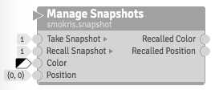
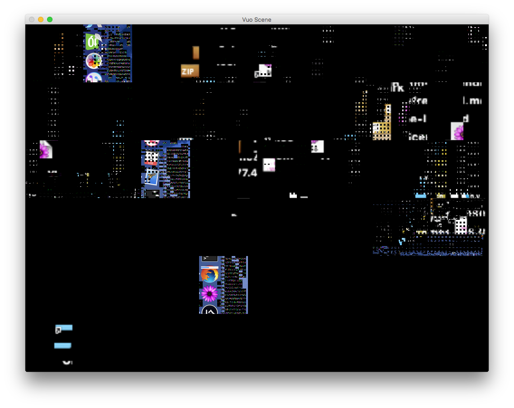
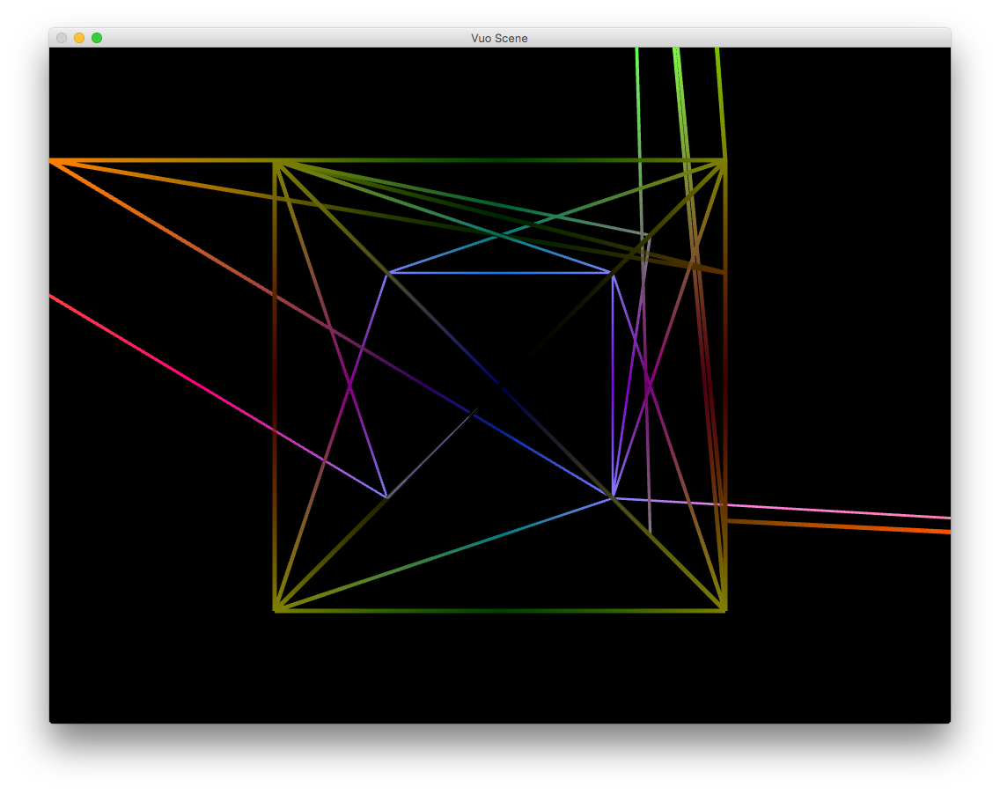
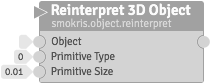
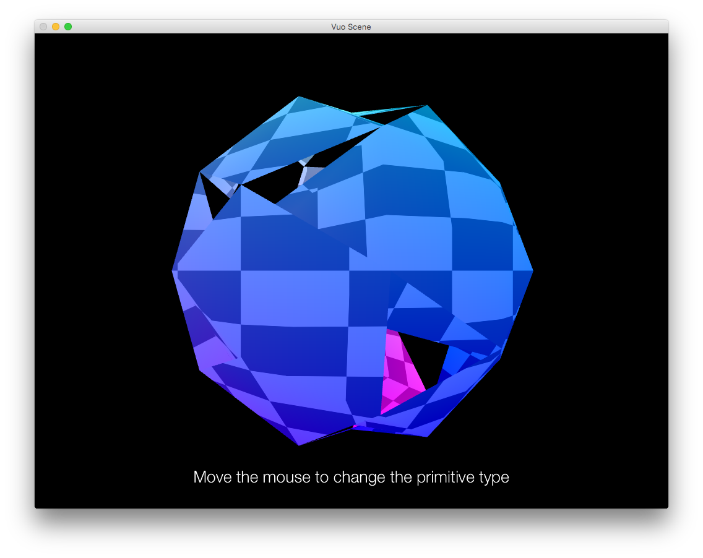

# smokris's useless [Vuo](http://vuo.org) nodes

These nodes are built for Vuo 1.2.x.  You may need to modify and rebuild them to use them with other Vuo versions.

## To install

Copy all the `.vuonode` files into your `~/Library/Application Support/Vuo/Modules` folder.

## Nodes

Node                                        | Output
------------------------------------------- | ------------------------------------------------
           |
  | 
 | 
 | 
